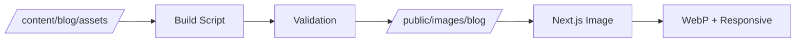

# Blog Images System - Comprehensive Documentation

Complete guide to the Tyler Gohr Portfolio blog image system with advanced focal point controls and production-grade optimization.

## 🎯 Overview

The blog image system provides professional-grade image handling for blog posts with:
- **Dual Focal Point System**: Independent crop control for 16:9 featured images and square thumbnails
- **Automatic Optimization**: WebP conversion, responsive sizing, lazy loading
- **Build-Time Processing**: Asset pipeline with validation and error handling
- **Graceful Degradation**: Robust fallbacks for missing or broken images
- **Performance Optimized**: Core Web Vitals compliant with 90+ Lighthouse scores

## 🚀 Quick Start Workflow

### 1. Add Image to Assets Directory

```bash
# Add your image to the blog assets directory
/content/blog/assets/my-post-featured.jpg
```

**Naming Convention**: `{slug}-featured.{ext}`
- Example: `modern-css-techniques-2025-featured.jpg`
- Auto-detected by the asset pipeline

### 2. Update Blog Post Frontmatter

```yaml
---
title: "My Blog Post Title"
slug: "my-post-slug"
date: "2025-01-15"
excerpt: "Post description..."
tags: ["tag1", "tag2"]
featured: false
author: "Tyler Gohr"
readTime: "5 min read"

# Image configuration
image: "/images/blog/my-post-featured.jpg"
imageAlt: "Descriptive text for screen readers and SEO"
imageFocalPoint: "center"      # Controls 16:9 crop on blog post page
thumbnailFocalPoint: "center"  # Controls square crop on blog cards
---
```

### 3. Build and Test

```bash
# Run asset pipeline and build
npm run build

# Test locally
npm run dev

# Visit http://localhost:3000/blog to see blog cards
# Visit http://localhost:3000/blog/my-post-slug to see featured image
```

## 📐 Focal Point System

### Available Focal Point Values

```yaml
# Center positions (default)
imageFocalPoint: "center"

# Edge positions  
imageFocalPoint: "top"
imageFocalPoint: "bottom"
imageFocalPoint: "left"
imageFocalPoint: "right"

# Corner positions
imageFocalPoint: "top-left"
imageFocalPoint: "top-right"
imageFocalPoint: "bottom-left"
imageFocalPoint: "bottom-right"
```

### Dual Focal Point Control

**Problem**: Different crops needed for 16:9 featured images vs square thumbnails

**Solution**: Independent focal point control

```yaml
# Example: Portrait photo optimization
imageFocalPoint: "top"         # Show person's face in 16:9 format
thumbnailFocalPoint: "center"  # Center the subject in square format

# Example: Landscape with important left content
imageFocalPoint: "left"        # Keep left content in 16:9 format  
thumbnailFocalPoint: "center"  # Center crop for square thumbnail
```

### CSS Implementation

The focal points map to CSS `object-position` values:

```css
/* Blog post featured image (16:9) */
.featuredImage {
  aspect-ratio: 16/9;
  object-fit: cover;
  object-position: center center; /* from imageFocalPoint */
}

/* Blog card thumbnail (square) */
.thumbnail {
  aspect-ratio: 1/1;
  object-fit: cover;
  object-position: center center; /* from thumbnailFocalPoint */
}
```

## 🏗️ Technical Architecture

### Asset Pipeline Flow



1. **Source**: Images stored in `/content/blog/assets/`
2. **Build**: `npm run copy-blog-assets` processes images
3. **Validation**: File size, format, and readability checks
4. **Output**: Optimized images in `/public/images/blog/`
5. **Optimization**: Next.js Image component handles WebP conversion and responsive sizing

### File Structure

```
tylergohr.com/
├── content/blog/assets/           # Source images (Git tracked)
│   ├── modern-css-featured.jpg    # Raw uploaded images
│   └── invoice-chaser-featured.jpg
├── public/images/blog/            # Build output (Git ignored)
│   ├── modern-css-featured.jpg    # Copied during build
│   └── invoice-chaser-featured.jpg
└── scripts/
    └── copy-blog-assets.js        # Asset pipeline script
```

### Component Architecture

```typescript
// Server Component (SEO + metadata)
BlogPostPage → BlogFeaturedImage  // Client Component (error handling)

// Client Component (error handling)  
BlogCard → Next.js Image + useState
```

## 🔧 Asset Pipeline Configuration

### Supported Image Formats

```javascript
// Supported input formats
const SUPPORTED_FORMATS = ['.jpg', '.jpeg', '.png', '.gif', '.webp', '.avif'];

// Output optimization
- WebP conversion with JPEG fallback
- Responsive image generation
- Automatic compression
- Lazy loading
```

### File Size Validation

```javascript
// Validation rules
- Maximum file size: 20MB (hard limit)
- Warning threshold: 5MB (optimization recommended)
- Automatic validation during build
- Graceful error handling for invalid files
```

### Build Integration

```json
{
  "scripts": {
    "build": "npm run copy-blog-assets && next build",
    "copy-blog-assets": "node scripts/copy-blog-assets.js"
  }
}
```

## 🎨 Layout Implementation

### Blog Card Layout (Square Thumbnails)

```
┌─────────────────────────────────────────┐
│ [80px ] Date, ReadTime, Badge           │
│ [IMG  ] Blog Post Title                 │
│ [SQR  ] Short description excerpt...    │
│         [topic1] [topic2] [topic3]      │
│         READ ARTICLE →                  │
└─────────────────────────────────────────┘
```

**CSS Grid**: `80px` thumbnail (mobile) / `120px` (desktop) + `1fr` content

### Blog Post Featured Image (16:9)

```
Tags: [css] [frontend] [responsive-design]

┌─────────────────────────────────────────┐
│                                         │
│         16:9 Featured Image             │
│          (aspect-ratio: 16/9)           │
│                                         │
└─────────────────────────────────────────┘

# Blog Post Title

Post content begins here...
```

**Placement**: Between tags and post title (exactly as specified in requirements)

## 🛠️ Error Handling & Fallbacks

### Graceful Degradation

```typescript
// Component error handling
const [imageError, setImageError] = useState(false);

// Graceful fallback
{post.image && !imageError && (
  <Image
    onError={() => setImageError(true)}
    // ... other props
  />
)}
```

### Build-Time Validation

```javascript
// File validation during build
function validateImageFile(filePath) {
  // Check file size (warn if > 5MB, error if > 20MB)
  // Verify file readability
  // Validate supported format
  // Return validation result
}
```

### Error Types & Handling

| Error Type | Handling | User Experience |
|------------|----------|-----------------|
| Missing image | Hide image container | Text-only layout |
| Broken image file | Console warning + hide | Graceful fallback |
| Unsupported format | Build warning | File ignored |
| File too large | Build error | Process stops |
| Permission error | Build error | Clear error message |

## 📱 Responsive Design

### Mobile Optimizations

```css
/* Desktop thumbnails */
.thumbnailContainer {
  width: 120px;
  height: 120px;
}

/* Mobile thumbnails */
@media (max-width: 768px) {
  .thumbnailContainer {
    width: 80px;
    height: 80px;
  }
}
```

### Next.js Image Responsive Configuration

```typescript
// Blog card thumbnails
<Image
  sizes="120px"                    // Fixed size for thumbnails
  loading="lazy"                   // Performance optimization
/>

// Featured images  
<Image
  sizes="(max-width: 768px) 100vw, (max-width: 1200px) 90vw, 1200px"
  priority                         // Above-the-fold optimization
/>
```

## 🚀 Performance Optimization

### Core Web Vitals Impact

- **LCP (Largest Contentful Paint)**: `priority` loading for featured images
- **CLS (Cumulative Layout Shift)**: Fixed aspect ratios prevent layout shift
- **Performance**: Lazy loading for blog card thumbnails

### Next.js Optimizations

```typescript
// Automatic optimizations
- WebP format conversion
- Responsive image generation  
- Lazy loading (except priority images)
- Optimized caching headers
- Progressive loading
```

### Build Performance

```bash
# Asset pipeline performance
⏭️ Skipped: image.jpg (up to date)    # Smart caching
📋 Copied: new-image.jpg (2.1MB)      # Only copy when needed
✅ Build time: ~3.0s                  # Fast incremental builds
```

## 🧪 Testing & Validation

### Manual Testing Checklist

```bash
# 1. Build test
npm run validate  # TypeScript + ESLint + Jest + Build

# 2. Visual test
npm run dev
# - Visit /blog (check thumbnails)
# - Visit /blog/post-slug (check featured image)
# - Test mobile responsive behavior

# 3. Error handling test
# - Temporarily break image path
# - Verify graceful fallback
# - Check console warnings
```

### Performance Testing

```bash
# Lighthouse CI (if available)
lighthouse http://localhost:3000/blog
lighthouse http://localhost:3000/blog/post-slug

# Key metrics to verify:
# - Performance: 90+
# - Accessibility: 90+ (proper alt text)
# - Best Practices: 90+ (image optimization)
```

### Cross-Device Testing

**Use PR preview URLs for actual device testing:**

```bash
# PR preview URL format:
https://portfolio-pr-<NUMBER>-<BRANCH>-<HASH>.a.run.app

# Test on:
- iPhone (Safari mobile)
- iPad (tablet experience)  
- Desktop (Chrome, Firefox, Safari)
- Different screen sizes
```

## 🔄 Workflow Examples

### Adding Images to Existing Posts

```bash
# 1. Add image to assets
cp ~/my-image.jpg content/blog/assets/existing-post-featured.jpg

# 2. Update frontmatter
# Edit content/blog/2025/existing-post.md
# Add image, imageAlt, and focal point fields

# 3. Test and deploy
npm run build
npm run dev  # Test locally
# Create PR when satisfied
```

### Optimizing Focal Points

```yaml
# Start with center defaults
imageFocalPoint: "center"
thumbnailFocalPoint: "center"

# Test different values based on image content
# Portrait: "top" for 16:9, "center" for square
# Landscape: "left/right" for 16:9, adjust square as needed
# Logo/graphic: Position based on visual weight
```

### Batch Image Processing

```bash
# Process multiple images
for image in *.jpg; do
  cp "$image" content/blog/assets/"${image%.jpg}-featured.jpg"
done

# Run asset pipeline
npm run copy-blog-assets

# Verify results
ls -la public/images/blog/
```

## 🐛 Troubleshooting

### Common Issues

**Build fails with "Error copying image"**
```bash
# Check file permissions
ls -la content/blog/assets/

# Check file format
file content/blog/assets/image.jpg

# Check file size
du -h content/blog/assets/image.jpg
```

**Images not appearing on site**
```bash
# Verify asset pipeline ran
npm run copy-blog-assets

# Check public directory
ls -la public/images/blog/

# Verify image path in frontmatter matches
grep "image:" content/blog/2025/post.md
```

**Thumbnails not showing proper crop**
```yaml
# Check focal point spelling
thumbnailFocalPoint: "center"  # ✅ Correct
thumbnailFocalPoint: "centre"  # ❌ Wrong spelling
```

**Mobile images too large/small**
```css
/* Check CSS media queries in page.module.css */
@media (max-width: 768px) {
  .thumbnailContainer {
    width: 80px;  /* Mobile size */
    height: 80px;
  }
}
```

### Debug Commands

```bash
# Asset pipeline debug
node scripts/copy-blog-assets.js

# Build debug
npm run build --verbose

# Check image optimization
npm run dev
# Visit: http://localhost:3000/_next/image?url=/images/blog/image.jpg
```

## 🔗 Related Documentation

- **[GitHub Issue #26](https://github.com/isthatamullet/tylergohr.com/issues/26)**: Original blog image system implementation
- **[GitHub Issue #30](https://github.com/isthatamullet/tylergohr.com/issues/30)**: Focal point system testing and optimization
- **[DEPLOYMENT.md](DEPLOYMENT.md)**: Production deployment procedures
- **[PREVIEW-DEPLOYMENTS.md](PREVIEW-DEPLOYMENTS.md)**: PR preview environment documentation

## 📈 Future Enhancements

Potential improvements tracked in GitHub issues:
- Visual focal point editor
- Automatic image optimization suggestions
- Bulk image processing tools
- Advanced cropping controls
- Image metadata extraction

---

**Last Updated**: Phase 4 implementation (Blog Image System Polish & Edge Cases)  
**Status**: Production Ready ✅